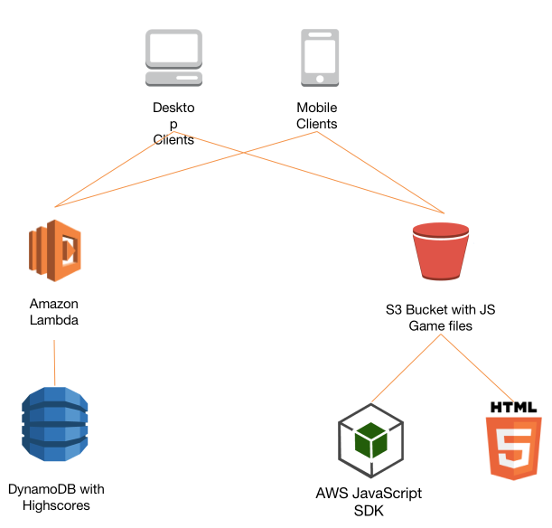

AWS Jumpy Fish for Shanghai Submit 2015
===========

A Lambda Function as "Flappy Bird" like game backend.

## Running on AWS

- Create a lambda function used the [source code](lambda_functions/aws-bird.js)

- Create a DynomDB table named `aws-bird-highscore` used `uuid` as hash index.

- Modified the source code [config.js](web/js/config.js) according to your deployment.

- Create a bulket on S3 and enable the static website, upload all the [web](web) static resources to this bulket.

- At last brower the S3 website to test!

## Special Thanks

Thanks a lot for our HK SA for contribute [Ellison Leão](https://medium.com/@ellisonleao/clumsy-bird-an-open-source-flappy-bird-clone-cf615724730f)
